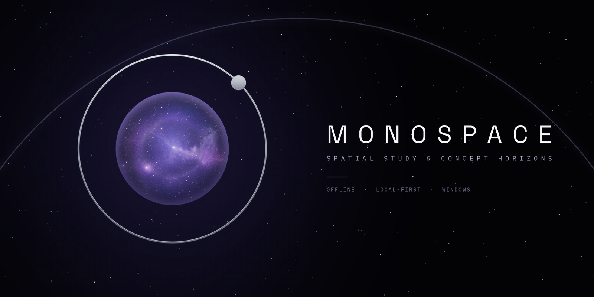

# MonoSpace

A study app that turns lecture slides and notes into decks, lessons, flashcards, tests and
games. It runs entirely on your own PC. There is no account, no sign-in and no cloud: your
decks and progress stay in a local database on your computer.

- **Builds decks from your modules.** Slide PDFs with a text layer are read directly, with no AI
  needed. Pasted notes, prose PDFs and picture slides use AI.
- **Study modes:** spaced-repetition review, multiple choice, typed answers, flashcards, a study
  guide, test papers, and an AI teacher you can ask questions.
- **AI is optional:**
  - online, it uses **Claude** through the official Claude Code program (your own Claude plan);
  - offline, or without Claude, it uses **Qwen** running locally through Ollama;
  - with neither, everything except the AI features still works.
- **No API keys.** Nothing is sent anywhere except the AI requests you make.
- **Offline-first.** After the first install, it works with Wi-Fi off.

Free and open source (MIT licence).

## Install (Windows 10/11)

Download from the [GitHub Releases](../../releases) page. Choose one:

- **`MonoSpace-Setup.exe`** (recommended). Run it. It installs for your Windows account only
  (no administrator needed) into `%LOCALAPPDATA%\Programs\MonoSpace`, adds a Start menu entry and,
  if you tick it, a desktop icon. Uninstall it from **Settings → Apps**. Uninstalling removes the
  program only, never your data folder or your settings.
- **`MonoSpace-<version>-portable.zip`**. Unzip it anywhere (e.g. `Documents\MonoSpace`) and
  double-click `MonoSpace.exe`. Nothing is installed; delete the folder to remove it.

**"Windows protected your PC".** MonoSpace isn't code-signed, so SmartScreen may say the
publisher is unknown the first time. Click **More info → Run anyway**.

**First start.** MonoSpace asks where to keep your data, suggesting `%USERPROFILE%\MonoSpaceData`.
Click **Change…** to pick another folder (for example one OneDrive backs up), then **Start**. Your
database, backups and module PDFs go there. The choice is saved in
`%APPDATA%\MonoSpace\settings.env`, which has the same settings as the developer `.env` (open it in
Notepad to change them, then restart MonoSpace).

MonoSpace opens in its own window. Closing the last MonoSpace window stops it. Starting it again
while it's open just opens another window. You need Microsoft Edge (built into Windows);
without it, MonoSpace opens in your default browser. Logs are in `%LOCALAPPDATA%\MonoSpace\logs`.

### From source (developers)
You need **Python 3.12** ([python.org](https://www.python.org/downloads/); tick
"Add python.exe to PATH" while installing).

1. **Get MonoSpace.** Run `git clone`, or on GitHub click **Code → Download ZIP** and unzip it.
2. **Choose where your data lives.** In the MonoSpace folder, copy `.env.example` to `.env`, open
   it in Notepad, and set `DATA_DIR` to a folder **outside** the MonoSpace folder, for example:
   ```
   DATA_DIR=C:\Users\<you>\MonoSpaceData
   ```
   Create that folder.
3. **Start it.** Double-click `start.bat`. The first start needs internet once, to install the
   Python packages. After that it opens MonoSpace in your browser at `http://localhost:8765`.

**Build the downloads yourself:** `powershell -ExecutionPolicy Bypass -File packaging\build.ps1`
builds `MonoSpace.exe` (PyInstaller), then `MonoSpace-Setup.exe` (Inno Setup, installed per-user
with winget if it's missing), then the portable zip, into `dist\`. To try a build without touching
your real settings, set `MONOSPACE_HOME` to a scratch folder first: `settings.env`, the logs and the
window profile then live there, and the suggested data folder is `<MONOSPACE_HOME>\MonoSpaceData`.

### Optional: offline AI with Qwen
Qwen needs a graphics card with about 8 GB of memory, and a download of about 6.6 GB.
1. Install [Ollama](https://ollama.com/download).
2. In a terminal, run `ollama pull qwen3.5:9b`.
3. Restart MonoSpace. `settings.env` (or `.env`) has the settings (`OLLAMA_MODEL`, `OLLAMA_NUM_CTX`). Keep
   `OLLAMA_NUM_CTX=8192` on an 8 GB card; raise it only if `ollama ps` still shows 100% GPU.

### Optional: Claude when online
1. Install [Claude Code](https://claude.com/claude-code) and sign in with your own Claude plan.
2. Make sure `CLAUDE_CLI=on` in `settings.env` (or `.env`).

MonoSpace then sends AI requests to Claude whenever you're online, and to Qwen when you're not.
It runs the official `claude` program. It never uses an API key and never reads your login.

## Your data
- Everything lives in your `DATA_DIR`: the database `drill.db`, automatic snapshots in `backups\`,
  and your module PDFs in `modules\`. Nothing is ever uploaded.
- **Manage → Download a backup** gives you one portable file at any time. **Restore** merges a
  backup in, and it never deletes anything.
- Snapshots of the database are taken every time MonoSpace starts, and once a day.

## For developers
| Folder | |
|---|---|
| `app/` | The web app (a single HTML file, with pdf.js and fonts in `app/vendor/`) |
| `server/` | The local server: FastAPI + SQLite, the AI router, the module library |
| `tests/` | Reader regression tests (`npm test`) and server tests (`python -m pytest`) |
| `tools/` | Import verification, the secrets check |
| `packaging/` | The Windows build: PyInstaller spec, Inno Setup script, icon, `build.ps1` |
| `assets/` | The MonoSpace icon |
| `docs/` | Architecture, API, offline AI |

Run the tests:
- `npm test`
- `.venv\Scripts\python -m pip install -r requirements-dev.txt`, then `.venv\Scripts\python -m pytest`

## Licence
MIT. See [LICENSE](LICENSE).
